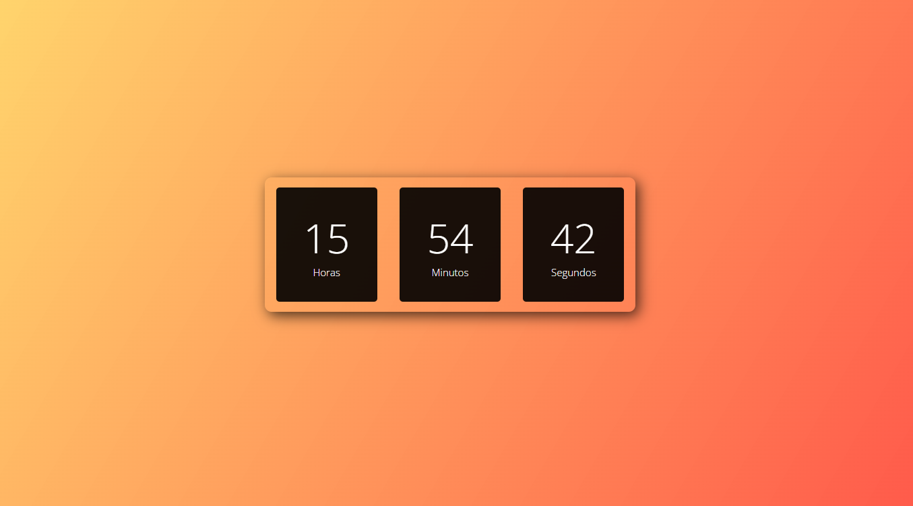

# Relógio Digital

Este é um projeto de um relógio digital que exibe as horas do seu computador. O relógio é atualizado em tempo real e mostra horas, minutos e segundos.

## Demonstração

## Funcionalidades

- Exibe horas, minutos e segundos do relógio do seu computador.
- Atualização em tempo real.
- Interface simples e fácil de usar.